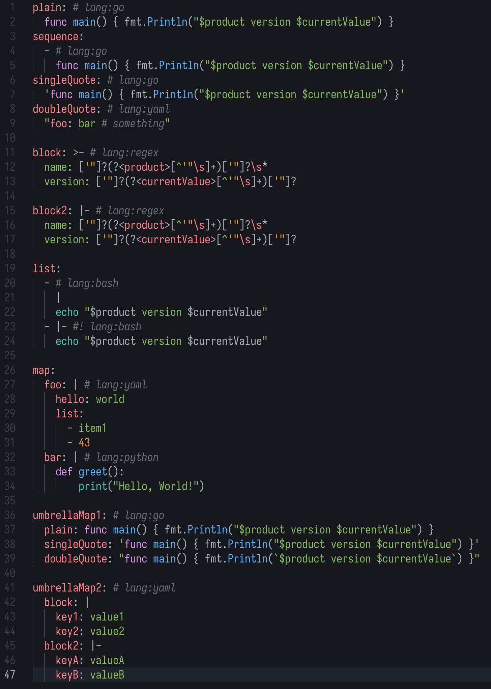

# `yaml-lang` Module

This module provides Tree-sitter queries to inject various languages in YAML files based on comments (e.g., `# lang:python`).

<p align="center">
  <a href="show.png" target="_blank"></a>
</p>

## Supported comment formats

- `# lang:<language>`
- `#! lang:<language>` ([ytt](https://carvel.dev/ytt/) style)

## Supported languages

- Any language supported by your Tree-sitter installation.

## Supported yaml nodes

> [!NOTE]  
> YAML parser produces many various combinations of nodes.
> It is not always possible to place the marker comment in a convenient location.
> The module supports the most common cases, but some edge cases may not be covered.
> Feel free request support for additional node types if needed.

Most of the currently supported cases are covered in the [test file](./queries/yaml/test/lang.yaml).
All [injection queries](./queries/yaml/injections.scm) are commented with examples.

### Examples

```yaml
# Marker before plain scalar

key: # lang:<injection.language>
  <injection.content>

# Marker before quoted scalar (single or double quotes)

key: # lang:<injection.language>
  "<injection.content>"

# Marker before block scalar (|, |-, >, >-)

key: # lang:<injection.language>
  |
  <injection.content>

# Marker inside block scalar (|, |-, >, >-)

key: | # lang:<injection.language>
  <injection.content>

# Marker before block mapping pairs with plain scalars

key: # lang:<injection.language>
  subkeyN: <injection.content>

# Marker before block mapping pairs with quoted scalars (single or double quotes)

key: # lang:<injection.language>
  subkeyN: "<injection.content>"

# Marker before block mapping pairs with block scalars (|, |-, >, >-)

key: # lang:<injection.language>
  subkeyN: |
    <injection.content>

# Marker before block sequence items with plain scalars

key: # lang:<injection.language>
  - <injection.content>

# Marker before block sequence items with quoted scalars (single or double quotes)

key: # lang:<injection.language>
  - "<injection.content>"

# Marker before block sequence items with block scalars (|, |-, >, >-)

key: # lang:<injection.language>
  - |
    <injection.content>
```
